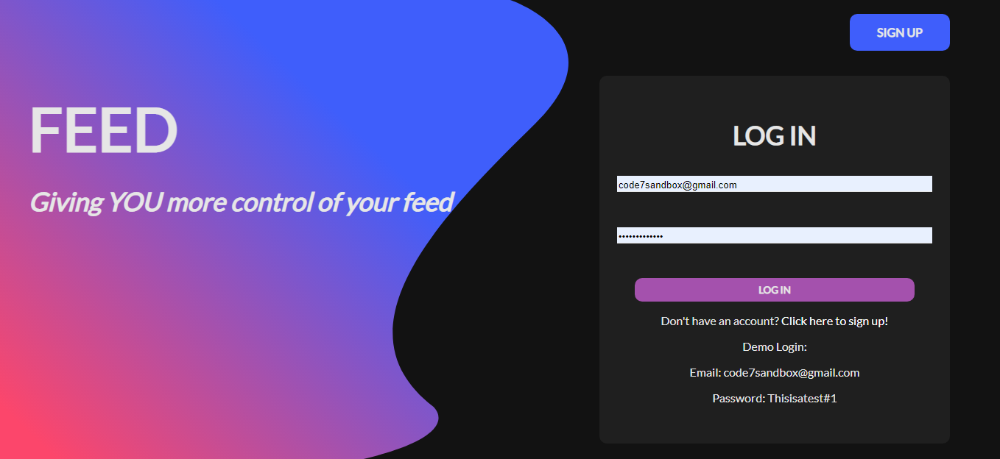
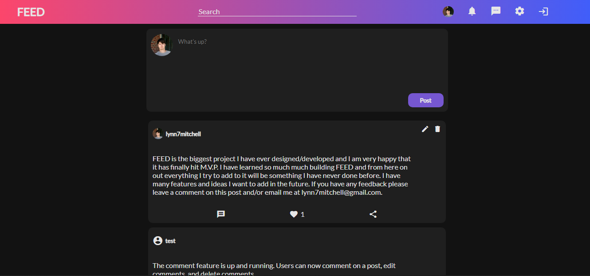
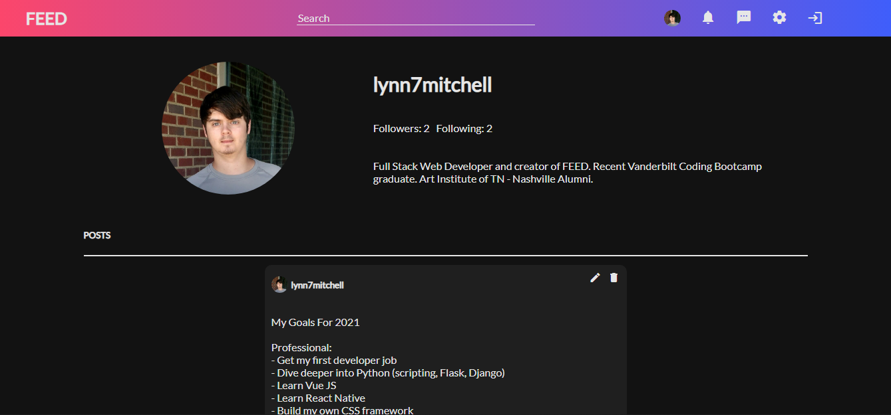

# Feed (Working Title)
Feed is a social network app. I wanted to start this project because it is something I can always continue to work on and add more features. I also wanted to create a social media app that combines all the features that the others use. This project has pushed me to learn new things more than any other project has.

Live Link: http://feed-social-media.herokuapp.com/

## Built Using

- React.js
- SASS
- Node.js
- Express.js
- MongoDB
- Mongoose ODM

## What's it look like?

### Home

### Dashboard

### Profile Page

